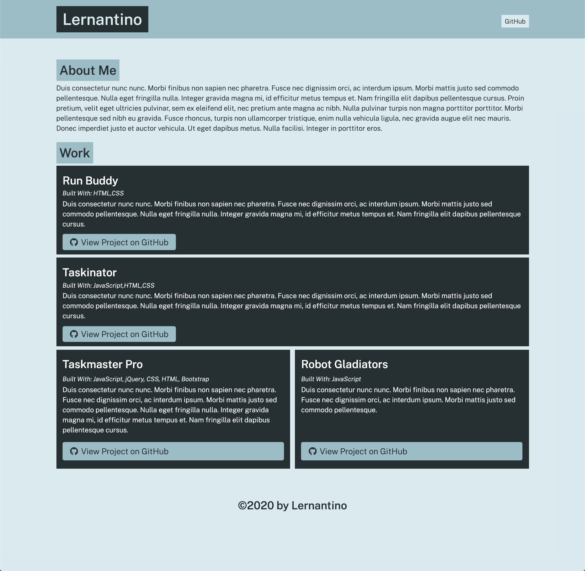

# Portfolio Generator

In this lesson, we are introduced to Node.js, npm, and some codes that extend the functionality of Node such as Inquirer and File System! The purpose of this application is to automatically generate a portfolio in an `.html` format with the prompts provided by the user.

As a user, the repo needs to be cloned, and then it's dependancies need to be installed by executing the command:
```
npm i -y
```

Node then needs to be executed in the terminal with the following command:
```
node app.js
```

The terminal will then ask the user a series of questions, and the responses will be used to generate the html file that will display a portfolio. The user is able to add as many projects as they want, along with having certain projects be featured.

## Screenshots
#### Website Preview
